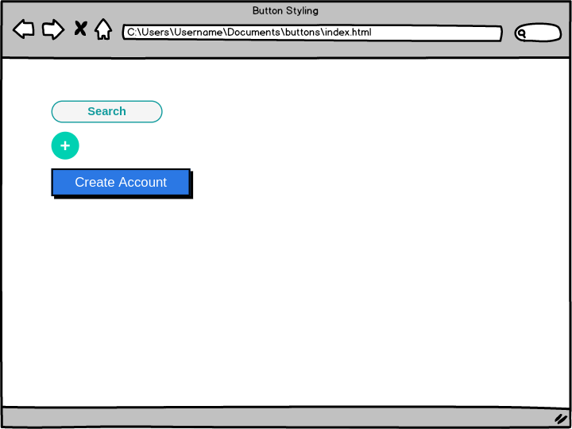

# Button Up

## Codiing Dojo Practice CSS

Objectives:
* Use what we've learned about the ```border``` and ```border-radius``` CSS properties
* Use what we've learned about: ```height``` and ```width``` CSS properties
* Optional: Explore using the box-shadow CSS property: https://developer.mozilla.org/en-US/docs/Web/CSS/box-shadow

Recreate the look of the ```<button>text</button>``` tags in the image below.

